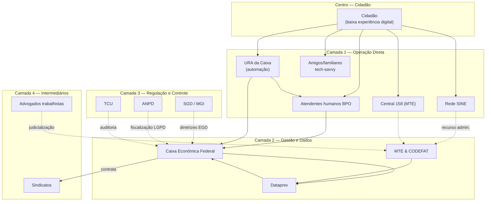

# C — Mapa de Atores

**Jornada:** Atendimento ao Seguro-Desemprego pela URA da Caixa
**Propósito:** Auxiliar a Caixa a tornar a URA efetiva para solução dos problemas do cidadão com eficiência e sem desperdício de tempo.
**Foco:** Cidadão com baixa experiência digital

---

## Diagrama de Atores (Onion)

---

## Tabela de Atores

### Matriz Poder × Interesse (Mendelow)

| # | Ator | Camada | Poder | Interesse | Classificação |
|---|------|--------|-------|-----------|---------------|
| 1 | Cidadão (baixa experiência digital) | Centro | Baixo | Alto | Manter informado |
| 2 | URA da Caixa (automação) | Operação | — | — | Canal focal |
| 3 | Atendentes humanos BPO | Operação | Baixo | Alto | Manter informado |
| 4 | Rede SINE | Operação | Baixo | Alto | Manter informado |
| 5 | Central 158 (MTE) | Operação | Baixo | Médio | Manter informado |
| 6 | Amigos/familiares tech-savvy | Operação | Baixo | Médio | Manter informado |
| 7 | Caixa Econômica Federal | Gestão | Alto | Médio | Gerenciar de perto |
| 8 | MTE & CODEFAT | Gestão | Alto | Alto | Gerenciar de perto |
| 9 | Dataprev | Gestão | Alto | Médio | Gerenciar de perto |
| 10 | SGD / MGI | Regulação | Alto | Baixo | Manter satisfeito |
| 11 | ANPD | Regulação | Médio | Baixo | Monitorar |
| 12 | TCU | Regulação | Médio | Baixo | Monitorar |
| 13 | Advogados trabalhistas | Intermediários | Baixo | Alto | Manter informado |
| 14 | Sindicatos | Intermediários | Médio | Médio | Monitorar |

---

## Incentivos e Resistências (Atores-Chave)

| Ator | Manutenção (o que ganha hoje) | Resistência (o que perderia) | Alavanca (o que ganharia) |
|------|------------------------------|-----------------------------|---------------------------|
| **Cidadão** | Sofre a fricção, desiste do benefício | Nenhuma | Serviço resolutivo sem desperdício de tempo |
| **Caixa** | Contrato de BPO gera receita corrente | Investimento em redesign técnico | Redução de reclamações no BC/TCU; imagem positiva |
| **MTE/CODEFAT** | URA inefetiva reduz desistências → menos dispêndio do FAT | Perda da "barreira fiscal" oculta | Crédito político por entrega digna; redução de judicialização |
| **Dataprev** | Consultas manuais justificam orçamento | Custo de migrar para interoperabilidade síncrona | Reputação como backbone tecnológico do governo |
| **Empresas de BPO** | Remuneração por volume de ligações → recontato é receita | Contratos menores se URA resolver na 1ª chamada | Estabilidade contratual com métricas de qualidade |
| **Atendentes BPO** | Sofrem com URA mal desenhada (re-digitação, sem contexto) | Nenhuma — são vítimas do design | Serem fonte de inteligência para melhoria da URA |
| **SGD/MGI** | Risco reputacional nos rankings | Nenhuma relevante | Serviço alinhado à EGD = vitrine de governo digital |

---

## Hipóteses de Fricção e Failure Demand

1. **Barreira fiscal (MTE/CODEFAT):** A fricção da URA opera como filtro não declarado — cidadãos que desistem reduzem o dispêndio do FAT sem necessidade de negativa explícita.
2. **Volume vs. resolução (Caixa + BPO):** Contratos pagos por chamada atendida, não por problema resolvido. O incentivo econômico é oposto à efetividade.
3. **Interoperabilidade em lote (Dataprev):** Consultas por batelada em vez de síncronas geram retrabalho e informação desatualizada na URA.

### Métricas Recomendadas

| Dimensão | Métrica | Alvo sugerido |
|----------|---------|---------------|
| Qualidade/Resolução | First Contact Resolution (FCR) | > 70% |
| Volume/Composição | Proporção Value Demand / Failure Demand | Value > 60% |
| Acesso/Inclusão | Drop-off rate por etapa da URA | < 10% por nó |
| Custo | Custo por problema resolvido (não por chamada) | Redução anual |
